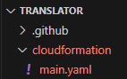

# translator

### Access here: //Fixme url

 

## Description
This project is a a translator application built with Angular, github actions, and aws.

 

## Deploy it yourself!

Step 1: Copy the Repo.

* Fork this repository to copy it to your git account.
* Clone your copy down to your local machine.

Step 2: Deploy Cloudformation template

* Go to the aws Cloudformation console at https://us-east-1.console.aws.amazon.com/cloudformation.
* Ensure your region is set to us-east-1.
    * The rest of this guide will assume you choose us-east-1.
* //FIXME insert picture
* Select "Create stack" and "With new resources(standard)"
* Click "Upload a template file" and "Choose file"

* Upload the file /cloudformation/main.yaml in this translator project.
