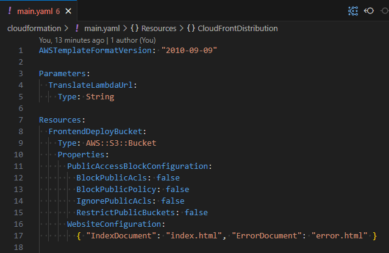

# translator

### Access here: //Fixme url

 

## Description
This project is a a translator application built with Angular, github actions, and aws.

 

## Deploy it yourself!

Step 1: Copy the Repo.

* Fork this repository to copy it to your git account.
* Clone your copy down to your local machine.

Step 2: Change the GithubActionsRole to your github account/repository.
* In the project you cloned to your local machine, find the file /cloudformation/main.yaml. Find the GithubActionsRole resource and change "repo:JeremyPflipsen/\*" to your Github account like "repo:YourGithubAccount/\*".

Step 3: Deploy Cloudformation template

* Go to the aws Cloudformation console at https://us-east-1.console.aws.amazon.com/cloudformation.

* Ensure your region is set to us-east-1.
    * The rest of this guide will assume you choose us-east-1.

* Select "Create stack" and "With new resources(standard)"

* Click "Upload a template file" and "Choose file"

* Upload the file /cloudformation/main.yaml in this translator project.

* Click "Next".

* Specify stack details
    * The stack name helps you identify each stack in your account, so pick something unique and descriptive to this project. I'll use TranslateAppStack.
    * The parameter TranslateLambdaUrl is the url where we'll call our translate lambda. We haven't deployed this yet, so for now put in a placeholder so the stack can build. We'll fix this later on. I'll use fixme.lambda-url.us-east-1.on.aws.
    

* Click "Next". Then scroll down and click "Next" again until you're on the "Review" screen.

* Scroll down. Click the checkbox to allow the stack to create IAM resources. Then click "Submit". This will move the stack to CREATE_IN_PROGRESS. We will have to wait until it's complete.

While that's creating, let me tell you about Cloudformation. Cloudformation is a tool that allows us to specify "logical" resources, like an S3 bucket, and then Cloudformation will create a physical resource to match. Our main.yaml file that we uploaded is where those logial resources are specified, like the FrontendDeployBucket.

The best feature of cloudformation is that it's *declarative*. Declarative means that we *declare* resources and Cloudformation will build them for us. It doesn't specify *how* it will make that resource. This is opposed to an *imperative* style, where we would write a list of every step needed to make this resource. This can become tedious and error-prone, since if 1 step fails then everything fails. Each is a valuable tool, but declarative is much better here.

* When the stack is in a CREATE_COMPLETE state, you'll be able to see the resources it has made. Each of these is specified in the main.yaml template file we uploaded.

    * CloudFrontDistribution is the Cloudfront distribution that will globally cache user requests to speed them up.
    * FrontendDeployBucket is the S3 bucket where we'll host our frontend.
    * GithubActionsRole is a IAM role that gives your Github account permissions to interact with AWS via Github Actions.
    * S3BucketPolicy is an IAM Policy that attached to your FrontendDeployBucket, specifying who can get objects from the bucket i.e. who can access the frontend website. In this case, we're delcaring that only the CloudFrontDistribution can access it, and nobody can access the bucket directly. This helps us ensure security because we can configure all user access through cloudfront.
    * TranslateFunctionRole gives permissions to our lambda function to access AWS Translate as well as create log events in Cloudwatch Logs, which is very useful for debugging.

Step 4: Deploy your frontend and lambda
* Click on the FrontendDeployBucket resource. This will take you to the S3 console displaying the physical S3 bucket Cloudformation created. Currently it's empty.
* Copy the bucket's name at the top.
    * If you don't specify an bucket name in the Cloudformation template, Cloudformation will generate a name for you as stackName-logicalResourceName-randomString.
    * Remember that all S3 bucket names must be *globally* unique.
    * Don't copy the "Info" text. It's a bit too easy to mess this up, I would know.

* Go to the translate project and find the folder /.github/workflows/main.yaml.
* Change the S3 bucket to the name you just copied like s3://your.bucket.name.

    * This directory /.github/workflows holds all workflows you want github actions to run. You can specify the condition upon which they run, like when a Pull Request is merged into main, and what commands you'd like to run.

* Go back your Cloudformation stack in the console.
* Click on the GithubActionsRole. This will take you to the IAM console displaying your Role.
* Copy the Role's ARN(Amazon Resource Names). ARNs are a unique identifier for each resource.

* Go to back to the /.github/workflows/main.yaml file.
* Paste in your role's ARN in the following 2 spots. This tells Github Actions which role to assume.

* Commit and push your changes to your remote Github repository.
* This Github Actions main.yaml workflow file is set up to automatically run when you push to your remote main branch, so it will run. As that runs, let me offer a couple explanations.

* An explanation of IAM Roles:
    * Iam Roles are *assumed*. They give some permission to the assuming entity, in this case your Github account. When assumed, the entity is given short-term credentials(a secret). Whenever the entity tries to interact with AWS, it sends these credentials. This proves the entity is who it says it(Authentication), and AWS gives the entity the permissions of the role(Authorization).
    * A role needs 2 things:
        * Permissions Policies which say what entities who've assumed the role can do
        * A Trust Relationship which dictates which entities can assume the role.
    * In this case we're setting the trust relationship to be only your github account, and we're giving it AdministratorAccess permissions, which allows it to do everything. In practice for security, you'd want to restrict the permissions to only what Github Actions needs.

* An explation of the workflow
    * There are 2 jobs in this workflow, deploy-frontend and deploylambda.
        * deploy-frontend runs a few commands but I notably:
            * npm run build compiles the Angular application into static content, which is planced into the /dist folder. This static content is what we serve to user's browsers for them to access the website.
            * aws s3 sync takes that content from the /dist folder and copies it to your FrontendDeployBucket where it'll be available for Cloudfront.
        * In deploylambda we use AWS's sam which provides tools for developing and deploying lambdas. More info here: https://aws.amazon.com/serverless/sam/

